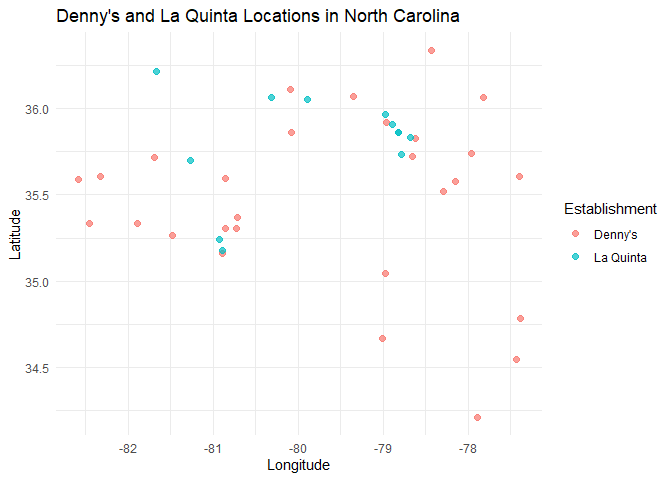
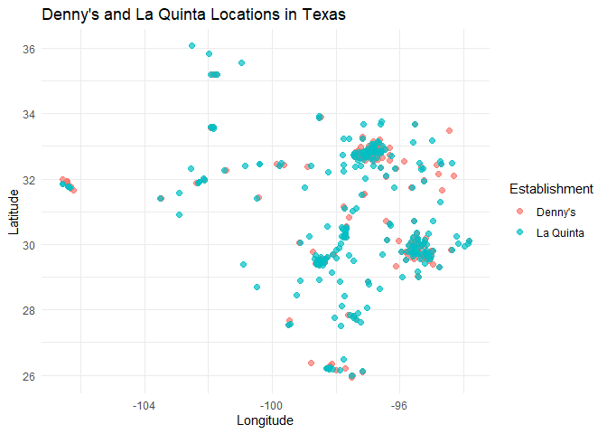

Lab 04 - La Quinta is Spanish for next to Denny’s, Pt. 1
================
Graham Overheu
2/6/2026

### Load packages and data

``` r
library(tidyverse) 
library(dsbox) 
```

``` r
states <- read_csv("data/states.csv")
```

``` r
dennys <- dennys
laquinta <- laquinta
```

### Exercise 1

There are 1643 rows and 6 columns. Each row represents one individual
Denny’s, while each columns represents a location-related variable.

### Exercise 2

There are 909 rows and 6 columns. Each row represents one individual La
Quinta hotel, while each columns represents a location-related variable.

### Exercise 3

La Quinta has locations in Canada, Mexico, China, Georgia, Turkey, New
Zealand, Colombia, and Ecuador. Denny’s does not seem to have any
locations outside of the US, according to the link provided.

### Exercise 4

We can look at the longitude and latitude of each location to see
whether or not each one is located in the US.

### Exercise 5

``` r
dennys %>%
  filter(!(state %in% states$abbreviation))
```

    ## # A tibble: 0 × 6
    ## # ℹ 6 variables: address <chr>, city <chr>, state <chr>, zip <chr>,
    ## #   longitude <dbl>, latitude <dbl>

There are no Denny’s locations outside of the US.

### Exercise 6

``` r
laquinta <- laquinta %>%
  mutate(country = case_when(
    state %in% state.abb ~ "United States",
    state %in% c("ON", "BC") ~ "Canada",
    state == "ANT" ~ "Colombia",
    state %in% c("CMX", "JAL", "NLE", "QUE") ~ "Mexico",
    state == "HN" ~ "Honduras",
    TRUE ~ "Other"
  ))
```

``` r
dennys %>%
  mutate(country = "United States")
```

    ## # A tibble: 1,643 × 7
    ##    address                        city    state zip   longitude latitude country
    ##    <chr>                          <chr>   <chr> <chr>     <dbl>    <dbl> <chr>  
    ##  1 2900 Denali                    Anchor… AK    99503    -150.      61.2 United…
    ##  2 3850 Debarr Road               Anchor… AK    99508    -150.      61.2 United…
    ##  3 1929 Airport Way               Fairba… AK    99701    -148.      64.8 United…
    ##  4 230 Connector Dr               Auburn  AL    36849     -85.5     32.6 United…
    ##  5 224 Daniel Payne Drive N       Birmin… AL    35207     -86.8     33.6 United…
    ##  6 900 16th St S, Commons on Gree Birmin… AL    35294     -86.8     33.5 United…
    ##  7 5931 Alabama Highway, #157     Cullman AL    35056     -86.9     34.2 United…
    ##  8 2190 Ross Clark Circle         Dothan  AL    36301     -85.4     31.2 United…
    ##  9 900 Tyson Rd                   Hope H… AL    36043     -86.4     32.2 United…
    ## 10 4874 University Drive          Huntsv… AL    35816     -86.7     34.7 United…
    ## # ℹ 1,633 more rows

## Exercise 7

La Quinta has locations in Canada, Mexico, China, Georgia, Turkey, New
Zealand, Colombia, and Ecuador.

## Exercise 8

``` r
laquinta <- laquinta %>%
  mutate(country = case_when(
    state %in% state.abb ~ "United States",
    state %in% c("ON", "BC") ~ "Canada",
    state == "ANT" ~ "Colombia",
    state %in% c("CMX", "JAL", "NLE", "QUE") ~ "Mexico",
    state == "EC" ~ "Ecuador",
    state == "CH" ~ "China",
    TRUE ~ "Other"
  ))
```

``` r
laquinta <- laquinta %>%
  filter(country == "United States")
```

## Exercise 9

``` r
dennys %>%
  count(state, sort = TRUE)
```

    ## # A tibble: 51 × 2
    ##    state     n
    ##    <chr> <int>
    ##  1 CA      403
    ##  2 TX      200
    ##  3 FL      140
    ##  4 AZ       83
    ##  5 IL       56
    ##  6 NY       56
    ##  7 WA       49
    ##  8 OH       44
    ##  9 MO       42
    ## 10 PA       40
    ## # ℹ 41 more rows

California has the most Denny’s locations, which is not surprising due
to its large population. Delaware has the fewest Denny’s locations which
is also not surprising due to its population size.

``` r
laquinta %>%
  count(state, sort = TRUE)
```

    ## # A tibble: 48 × 2
    ##    state     n
    ##    <chr> <int>
    ##  1 TX      237
    ##  2 FL       74
    ##  3 CA       56
    ##  4 GA       41
    ##  5 TN       30
    ##  6 OK       29
    ##  7 LA       28
    ##  8 CO       27
    ##  9 NM       19
    ## 10 NY       19
    ## # ℹ 38 more rows

Texas has the most amount if La Quinta locations, which is not
surprising due to it being one of the more frequently visited states.
However, I would’ve expected more than 74 to be in Florida, the state
with the second most locations. I am not surprised that Maine has the
least number of locations since it is a fairly isolated state from the
rest of the country, and hence there are not a significant number of
people traveling there per year.

## Exercise 10

``` r
dennys_density <- dennys %>%
  count(state) %>%
  inner_join(states, by = c("state" = "abbreviation")) %>%
  mutate(per_1000_sq_miles = n / area * 1000) %>%
  arrange(desc(per_1000_sq_miles))
```

Rhode Island, California, and Connecticut have the most Denny’s per 1000
square miles.

``` r
laquinta_density <- laquinta %>%
  count(state) %>%
  inner_join(states, by = c("state" = "abbreviation")) %>%
  mutate(per_1000_sq_miles = n / area * 1000) %>%
  arrange(desc(per_1000_sq_miles))
```

Rhode Island, Florida, and Connecticut have the most La Quintas per 1000
square miles.

## Exercise 11

``` r
dennys <- dennys %>%
  mutate(establishment = "Denny's")
laquinta <- laquinta %>%
  mutate(establishment = "La Quinta")
```

``` r
dennys_laquinta <- bind_rows(dennys, laquinta)
```

``` r
ggplot(dennys_laquinta, mapping = aes(
  x = longitude,
  y = latitude,
  color = establishment
)) +
  geom_point()
```

<!-- -->

``` r
locations <- bind_rows(dennys, laquinta)
```

``` r
locations %>%
  filter(state == "NC") %>%
  ggplot(aes(x = longitude, y = latitude, color = establishment)) +
  geom_point(alpha = 0.7, size = 2) +
  labs(
    title = "Denny's and La Quinta Locations in North Carolina",
    x = "Longitude",
    y = "Latitude",
    color = "Establishment"
  ) +
  theme_minimal()
```

<!-- --> Yes, Mitch
Hedberg’s joke seems to hold here.

## Question 12

``` r
locations %>%
  filter(state == "TX") %>%
  ggplot(aes(x = longitude, y = latitude, color = establishment)) +
  geom_point(alpha = 0.7, size = 2) +
  labs(
    title = "Denny's and La Quinta Locations in Texas",
    x = "Longitude",
    y = "Latitude",
    color = "Establishment"
  ) +
  theme_minimal()
```

<!-- --> Yes, Mitch
Hedberg’s joke seems to hold here.
